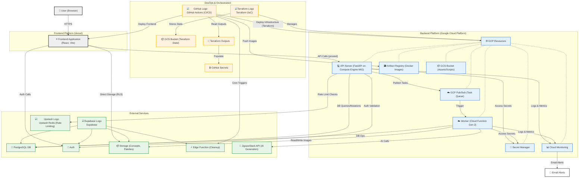

## System Architecture Diagram

```mermaid
graph TD
    %% -------- User & Client Tier --------
    User["👤 User (Browser)"]

    %% -------- Frontend Tier (Vercel) --------
    subgraph Vercel["Frontend Platform (Vercel)"]
        FrontendApp["⚛️ Frontend Application (React, Vite)"]
    end

    %% -------- Backend Tier (Google Cloud Platform) --------
    subgraph GCP["Backend Platform (Google Cloud Platform)"]
        APIVM["💻 API Server (FastAPI on Compute Engine MIG)"]
        PubSub["☁️ GCP Pub/Sub (Task Queue)"]
        WorkerCF["☁️ Worker (Cloud Function Gen 2)"]
        ArtifactRegistry["🗃️ Artifact Registry (Docker Images)"]
        SecretManager["🔑 Secret Manager"]
        GCSAssets["📦 GCS Bucket (Assets/Scripts)"]
        CloudMonitoring["📊 Cloud Monitoring"]
        GCPState["🌐 GCP Resources"]
    end

    %% -------- External Services --------
    subgraph External["External Services"]
        Supabase["<img src='https://seeklogo.com/images/S/supabase-logo-DCC676FFE2-seeklogo.com.png' width='20' alt='Supabase Logo'/> Supabase"]
        SupabaseDB["🐘 PostgreSQL DB"]
        SupabaseAuth["🔑 Auth"]
        SupabaseStorage["📦 Storage (Concepts, Palettes)"]
        SupabaseEdgeFunc["⚡ Edge Function (Cleanup)"]
        JigsawStack["🧩 JigsawStack API (AI Generation)"]
        UpstashRedis["<img src='https://avatars.githubusercontent.com/u/76460935?s=200&v=4' width='20' alt='Upstash Logo'/> Upstash Redis (Rate Limiting)"]
    end

    %% -------- CI/CD & IaC --------
    subgraph DevOps["DevOps & Orchestration"]
        GitHubActions["<img src='https://github.githubassets.com/images/modules/logos_page/GitHub-Mark.png' width='20' alt='GitHub Logo'/> GitHub Actions (CI/CD)"]
        Terraform["<img src='https://upload.wikimedia.org/wikipedia/commons/0/04/Terraform_Logo.svg' width='20' alt='Terraform Logo'/> Terraform (IaC)"]
        GCSState["📦 GCS Bucket (Terraform State)"]
        TerraformOutputs["📝 Terraform Outputs"]
        GitHubSecrets["🔒 GitHub Secrets"]
    end

    %% -------- Connections --------

    User -- "HTTPS" --> FrontendApp

    FrontendApp -- "API Calls (proxied)" --> APIVM
    FrontendApp -- "Auth Calls" --> SupabaseAuth
    FrontendApp -- "Direct Storage (RLS)" --> SupabaseStorage

    APIVM -- "DB Queries/Mutations" --> SupabaseDB
    APIVM -- "Auth Validation" --> SupabaseAuth
    APIVM -- "Publish Tasks" --> PubSub
    APIVM -- "Access Secrets" --> SecretManager
    APIVM -- "Rate Limit Checks" --> UpstashRedis
    APIVM -- "Logs & Metrics" --> CloudMonitoring

    PubSub -- "Trigger" --> WorkerCF
    WorkerCF -- "DB Ops" --> SupabaseDB
    WorkerCF -- "Read/Write Images" --> SupabaseStorage
    WorkerCF -- "AI Calls" --> JigsawStack
    WorkerCF -- "Access Secrets" --> SecretManager
    WorkerCF -- "Logs & Metrics" --> CloudMonitoring

    Supabase --> SupabaseDB
    Supabase --> SupabaseAuth
    Supabase --> SupabaseStorage
    Supabase --> SupabaseEdgeFunc

    GitHubActions -- "Push Images" --> ArtifactRegistry
    GitHubActions -- "Deploy Infrastructure (Terraform)" --> GCPState
    GitHubActions -- "Deploy Frontend" --> FrontendApp
    GitHubActions -- "Cron Triggers" --> SupabaseEdgeFunc
    GitHubActions -- "Read Outputs" --> TerraformOutputs
    TerraformOutputs -- "Populate" --> GitHubSecrets

    Terraform -- "Manages" --> GCPState
    Terraform -- "Stores State" --> GCSState

    GCPState -.- APIVM
    GCPState -.- WorkerCF
    GCPState -.- PubSub
    GCPState -.- ArtifactRegistry
    GCPState -.- SecretManager
    GCPState -.- GCSAssets
    GCPState -.- CloudMonitoring

    CloudMonitoring -- "Email Alerts" --> EmailAlerts["📧 Email Alerts"]

    %% Style Definitions
    classDef default fill:#fff,stroke:#333,stroke-width:2px;
    classDef gcp fill:#e3f2fd,stroke:#4285f4,stroke-width:2px,color:#333;
    classDef vercel fill:#f0f0f0,stroke:#000,stroke-width:2px,color:#333;
    classDef external fill:#e8f5e9,stroke:#34a853,stroke-width:2px,color:#333;
    classDef devops fill:#fff3e0,stroke:#fbbc05,stroke-width:2px,color:#333;

    class User,FrontendApp vercel;
    class APIVM,PubSub,WorkerCF,ArtifactRegistry,SecretManager,GCSAssets,CloudMonitoring,GCPState gcp;
    class Supabase,SupabaseDB,SupabaseAuth,SupabaseStorage,SupabaseEdgeFunc,JigsawStack,UpstashRedis external;
    class GitHubActions,Terraform,GCSState,TerraformOutputs,GitHubSecrets devops;
```
